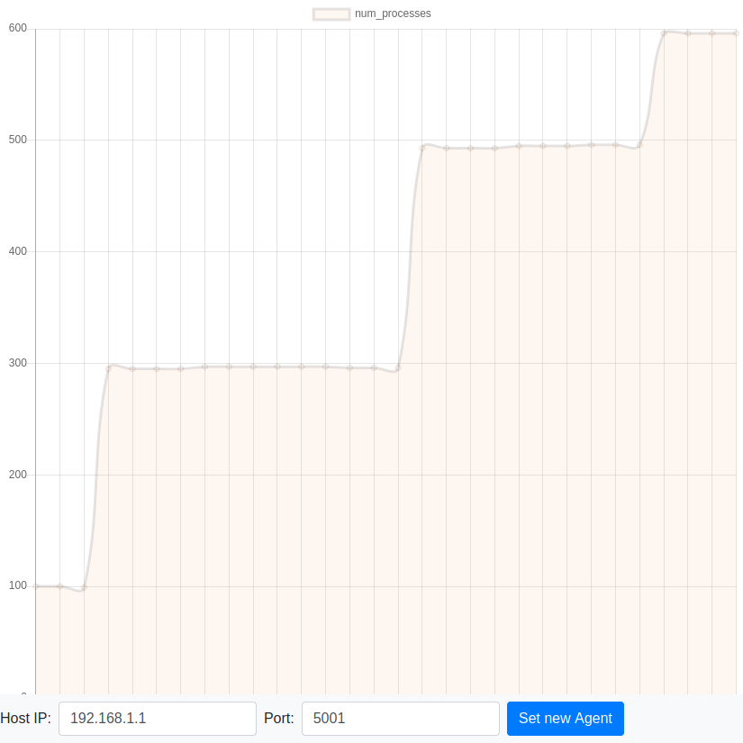

# Andrzej Swatowski - CloudAtlas

Andrzej Swatowski, as386085

Drugie zadanie zaliczeniowe z przedmiotu "Systemy rozproszone"

## Projekt
### Budowa
Backend projektu (interpreter, serwer oraz aplikacje klienckie) jest napisany w języku C#, frontend w JavaScripcie z pomocą frameworku VueJS.

Projekt korzysta z open source'owej dystrybucji .NET Core, która powinna działać nie tylko na Windowsie, ale także na Linuksie oraz systemach OS X. Niestety, wersja .NET Core zainstalowana na `students` nie działa poprawnie - `dotnet` wyrzuca błąd o braku odpowiedniej wersji OpenSSL. `dotnet` działa za to na komputerach w salach (tylko należy go samemu zainstalować jako paczkę Debiana) i przetestowałem w ten sposób trzy instancje agentów.
.NET Core poprawnie działa też chociażby na Ubuntu (projekt był pisany na Ubuntu 16.04 oraz Mac OS X Sierra), wystarczy zainstalować go zgodnie z instrukcją ze strony [dotnet](https://dotnet.microsoft.com/download/linux-package-manager/sdk-current).

Po zainstalowaniu `dotnet` zbudowanie projektu wymaga wpisania komendy:
```
dotnet build
```
w głównym katalogu projektu.

### Struktura i uruchomienie

Projekt podzielony jest na pięć aplikacji, z których każdą najłatwiej uruchomić wewnątrz odpowiadającego jej katalogu:
 - **Interpreter** jest samodzielną aplikacją konsolową, służącą za interpreter zapytań stylizowanych na SQL. Uruchomienie (`zmiFileName` jest opcjonalnym argumentem, oznaczającym ścieżkę do pliku opisującego wszystkie ZMI; domyślnie interpreter szuka pliku `zmis.txt`):
 ```bash
 cd Interpreter
 dotnet run [zmiFileName]
 ```
 **Errata:** Wydaje mi się, że poprawiłem błąd w interpreterze i w tym momencie nie można już wywołać samego `unfold`, bez złożenia go z funkcją agregującą.
 
 - **CloudAtlasAgent** jest serwerem RPC podzielonym na moduły oraz wrapperem na interpreter. Domyślnie uruchamiany jest pod adresem `127.0.0.1:5000` (moduł komunikacyjny) oraz `127.0.0.1:5001` (moduł RPC), ale są to konfigurowalne ustawienia. Prócz tego wymaga podania nazwy ZMI, którym zarządza oraz ścieżki do pliku z kluczem publicznym. Flagą `-i` oznaczamy ścieżkę do pliku konfiguracyjnego (dodano przykładowe pliki `random.ini` oraz `roundrobin.ini`). Opis poszczególnych opcji wyświetli się, gdy po wejściu do katalogu wpiszemy komendę `dotnet run -- --help`. Standardowe uruchomienie:
 ```bash
 cd CloudAtlasAgent
 dotnet run -- -k ../QuerySigner/rsa.pub -n "/uw/violet07"
 ```
Dla wygody testowania pozwoliłem sobie dodać do katalogu agenta skrypt `createAgent.sh`, który przyjmuje jako argumenty adres IP hosta, porty dla modułów komunikacyjnego i RPC i uruchamia agenta z jedną z predefiniowanych nazw (poprzez podanie liczby od 1 do 5 jako pierwszego argumentu):
```bash
cd CloudAtlasAgent
./createAgent.sh 1 127.0.0.1 5000 5001
```
Niestety, z nieodkrytego przeze mnie powodu Agent ma najwyraźniej jakiś wyciek pamięci lub/i problem z synchronizacją przerwanych wątków, przez co kliknięcie "Enter", by zakończyć program nie kończy się poprawnie (w przeciwieństwie do reszty aplikacji). Dlatego najlepiej jest zabijać go poprzez _Ctrl+C_.

 - **CloudAtlasClient** jest aplikacją kliencką, która komunikuje się z **Agentem** za pomocą wywołań RPC i służy za serwer HTTP wystawiający interfejs użytkownika przez stronę WWW. Podobnie, jak w przypadku **Agenta** możemy wyświetlić dodatkowe opcje uruchamiania za pomocą komendy `dotnet run -- --help`. Opcje pozwalają ustawić inny niż domyślny adres i port serwera, adres i port endpointu WWW klienta oraz adres i port **QuerySignera**.
 **Client** korzysta z inspirowanego Sinatrą i Flaskiem miniframeworku Nancy, by serwować stronę WWW i wystawiać REST API z danymi pobieranymi z **Agenta**. Strona internetowa napisana została za pomocą frameworku VueJS, jej źródła znajdują się w katalogu `FrontEnd` (podkatalog korzenia projektu), jednakże z racji tego, że wykorzystują do kompilacji NPMa postanowiłem ostatnią, skompilowaną już wersję umieścić bezpośrednio w folderach **Clienta**, w folderze `dist`. Frontend co 10 sekund wysyła RESTowe zapytanie do **Clienta**, by aktualizować swoje dane (a w szczególności wykresy).
 Z poziomu strony WWW możemy ustawiać adres i port agenta, od którego chcemy otrzymywać informacje. Przy uruchomieniu klient stara się połączyć z agentem o adresie IP i porcie podanym jako argument linii poleceń (domyślnie `127.0.0.1:5000`).
 ```bash
 cd CloudAtlasClient
 dotnet run
 ```

 - **Fetcher** jest drugą aplikacją kliencką, który aktualizuje na bieżąco dane o maszynie na której działa poprzez uruchomienie bashowego skryptu `fetch.sh`. Podobnie, jak poprzednie aplikacje pozwala na wyświetlenie pomocy z opisem opcji za pomocą `dotnet run -- --help`. Do uruchomienia potrzebuje podania ścieżki do pliku inicjalizacyjnego oraz nazwy ZMI, do którego ma wysyłać dane, np.:
 ```bash
 cd Fetcher
 dotnet run -i sample.ini -n "/uw/violet07"
 ```
 Prócz tego za flagą `-c` możemy podać ścieżkę do pliku, z którego można parsować awaryjne kontakty. Standardowo chcielibyśmy użyć więc flagi `-c contacts.txt`, dodatkowo dołączony skrypt `setContact.sh` zapisuje do `contacts.txt` pojedynczy zapasowy kontakt (w formie singletona kontaktów, który możemy samodzielnie rozszerzać).
 Dodatkowo, skrypt `runFetcher.sh` także zakłada istnienie pliku `contacts.txt`, a wywołujemy go w podobny sposób jak skrypt dla agenta, tylko bez dodatkowego portu komunikacyjnego. W takim wypadku wygodnym może się okazać wywołanie:
 ```bash
 ./setContact.sh /uw/khaki13 10.10.10.1 6000
 ./runFetcher.sh 1 127.0.0.1 5001
 ```

 - **QuerySigner** służy do podpisywania zapytań, które dodajemy za pomocą interfejsu WWW klienta. Wymaganym parametrem jest `-k`, wskazujący ścieżkę do prywatnego klucza, jednakże pozostałe opcje można - podobnie jak w przypadku pozostałych aplikacji - zobaczyć wywołując aplikację z flagą `--help`:
 ```bash
 dotnet run -- -k rsa.private
 ```
 W katalogu **QuerySignera** umieszczone zostały wygenerowane wcześniej klucze RSA, z których korzysta skrypt agenta (trzymanie kluczy RSA w jednym katalogu dostępnym dla wszystkich nie jest zbyt bezpieczne, ale pozwoliłem sobie na takie zaniedbanie na rzecz testów). Oczywiście, możemy wygenerować nowe klucze za pomocą odpowiednich flag - komenda `dotnet run -- --generate --genpath test` utworzy nowe klucze i umieści je w plikach `testrsa.pub` oraz `testrsa.private`.

Oprócz tego część plików projektu znajduje się w katalogu `Shared`. Umieszczone tam zostały pliki Modelu CloudAtlasa, deklaracja metod możliwych do wywoływania przez RPC oraz liczne klasy i funkcje pomocnicze, które są wykorzystywane przez wszystkie aplikacje.

Dodatkowo w folderze z projektem umieściłem też plik `wykres.png`, który pokazuje zachowanie wykresu funkcji `SELECT sum(num_processes) AS num_processes` w korzeniu sieci przy testowaniu na pięciu maszynach wirtualnych:

Na wykresie możemy zauważyć trzy skoki - pierwsze dwa powiązane są z odnalezieniem przez agenta ZMI pozostałych node'ów w sieci, ostatni skok z uruchomieniem setki śpiących projektów na jednej z maszyn.
